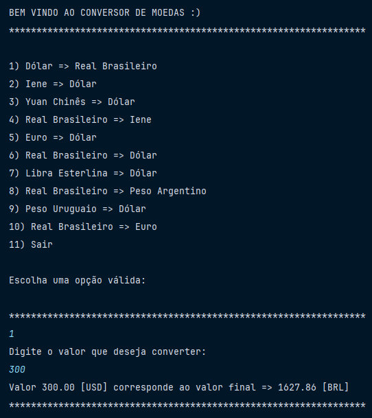

# Conversor de Moeda

O objetivo deste projeto é converter o valor de uma quantidade requerida para
outra moeda.

## 🔨 Funcionalidade do projeto

### => Conversão 

## ✔️ Técnicas e tecnologias utilizadas

- Java
- Exchange Rate API
    
## ☕️ Modo de usar

1. Escolher uma das opções de conversão
2. Preencher o valor
3. Voltar ao passo 1 ou Sair
    
## 📁 Acesso ao projeto

1. Obter a chave: [Exchange Rate API](https://www.exchangerate-api.com/)
2. Clonar este repositório
3. Criar uma variável de ambiente “API_KEY"
2. Executar Principal